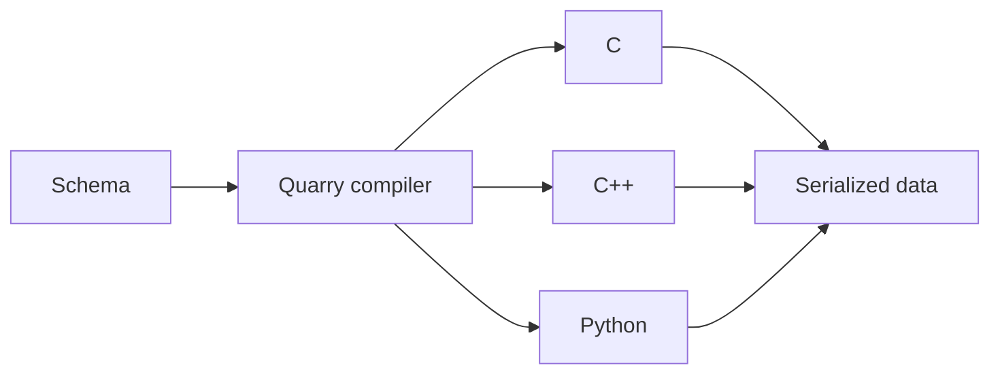

# Quarry

Quarry is a deterministic, language-neutral schema compiler and binary
serialization framework for embedded and systems programming. It consumes
`.brd` schemas and generates BRF-compatible C++, strict-C99 C, and Python code
for bounded, embedded-friendly data models.

## What is Quarry?

Quarry lets you define structured data once and generate type-safe APIs for
multiple environments. The generated C, C++, and Python implementations use
the same binary record format and serialization rules, so an embedded producer
and a Python tool can exchange the same data without maintaining separate data
models by hand.

Quarry is intended for bounded data exchanged in systems such as:

- MCU ↔ embedded Linux communication
- device telemetry
- configuration and state exchange
- recorded sensor or diagnostic data
- interoperability between embedded software and Python tooling

## Why Quarry?

Schema-driven serialization and multi-language code generation are established
ideas, with technologies such as Protocol Buffers already solving much of this
problem. Quarry applies those ideas specifically to embedded and systems
software, with an emphasis on predictable resource use, small and explicit
runtimes, C/C++ integration, cross-platform interoperability, and behavior that
can be understood and validated on constrained targets.

The schema is the shared source of truth for the data model, generated APIs,
and wire representation. That makes the relationship between a record in an
embedded program, its serialized bytes, and a desktop or Python consumer
explicit and reviewable.

## Workflow



The compiler generates language-specific APIs; applications then encode and
decode the same serialized records using the backend appropriate to their
environment.

## Schema → generated API → application

Input (`schema.brd`):

```yaml
namespace: demo
record: Sample
version: 1
type: data
fields:
  count:
    type: uint32
```

For C++, Quarry generates a typed record API with a builder and encode/decode
functions (among other generated details):

```cpp
demo::SampleBuilder builder;
builder.set_count(42U);
auto encoded = demo::encode(builder.build());
auto decoded = demo::decode_Sample(bytes);
```

The same schema can be generated for C or Python with their corresponding
type-safe APIs. The generated code is intentionally kept out of this README;
see the [examples](examples/README.md) for complete consumers.

## Quick Start

The quickest complete path is the installed CMake workflow in
[`examples/cpp/schema_compiler_cmake`](examples/cpp/schema_compiler_cmake). It
generates a root schema and its imported dependency into one output tree,
builds a C++ consumer, and performs a BRF encode/decode round trip.

Requirements: Git, CMake 3.20 or newer, and a C++20 compiler.

Clone and build Quarry:

```sh
git clone https://github.com/ip332/quarry.git
cd quarry
cmake --preset debug
cmake --build --preset debug --parallel
cmake --install build/debug --prefix "$PWD/build/install"
```

The example uses this root schema (`examples/cpp/schema_compiler_cmake/schema.brd`):

```yaml
namespace: quarry.telemetry
record: Sample
version: 1
type: data
imports:
  - shared.brd
fields:
  count:
    type: uint32
  child:
    type: quarry.shared.Child
```

Its imported `shared.brd` defines `quarry.shared.Child`. The CMake helper
invokes the installed `Quarry::schema_compiler` target for both source units.

Configure the example against the local installation:

```sh
cmake -S examples/cpp/schema_compiler_cmake \
  -B build/first-example \
  -DCMAKE_PREFIX_PATH="$PWD/build/install"
```

Build it. This runs the compiler and compiles the generated C++ sources:

```sh
cmake --build build/first-example
```

The generated output includes:

```text
build/first-example/generated/quarry/shared.generated.hpp
build/first-example/generated/quarry/telemetry.generated.hpp
```

Run the consumer:

```sh
./build/first-example/quarry_schema_compiler_cmake
```

Expected output:

```text
decoded count: 42
```

The consumer builds a `Sample`, encodes it, decodes it, and checks both the
`count` value and the imported child record. This is the same schema →
compiler → generated code → application path shown above.

## Supported backends

Quarry currently generates APIs for C++, strict-C99 C, and Python. The C and
C++ runtimes are designed for bounded, embedded-friendly records; the Python
backend supports the corresponding generated data model and BRF serialization
for tooling and interoperability. Imported source units are generated as
explicit roots into the same output tree. See the [complete examples](examples/README.md)
for each backend and the cross-language C++/Python workflow.

## Performance & footprint

Quarry includes a reproducible [benchmark suite and methodology](benchmarks/README.md)
covering telemetry, configuration, nested, large-payload, and small-message
stress workloads. The latest published baseline is from `main` commit
`04349e57` using five aggregated runs on a Linux/x86_64 GitHub-hosted runner
(AMD EPYC 7763), with a Release build, C++ 13.3.0, and Protobuf/protoc 3.21.12.

The representative measurements below are medians from that baseline. Throughput
is in operations per second; encoded sizes are bytes per record.

| Workload | Quarry C | Quarry C++ | Protobuf C++ | Protobuf Arena |
| --- | ---: | ---: | ---: | ---: |
| Telemetry encode | 9.69M | 1.17M | 18.81M | 10.38M |
| Telemetry decode | 5.45M | 3.55M | 13.48M | 12.18M |
| Large encode | 0.48M | 0.15M | 1.60M | 0.37M |
| Large decode | 0.85M | 0.21M | 0.57M | 0.45M |

| Workload | Quarry BRF | Protobuf |
| --- | ---: | ---: |
| Telemetry | 60 bytes/record | 16 bytes/record |
| Large | 1,661 bytes/record | 1,425 bytes/record |

BRF and Protobuf are different wire formats, so their encoded sizes are shown
separately and are not byte-compatible comparisons. Quarry C uses caller-owned
fixed-capacity buffers; Quarry C++ uses owning values; Protobuf C++ and Arena
use their respective owning and arena APIs. These ownership and allocation
models are intentional methodology differences, not a backend-quality ranking.

For the same run, the generated-source and benchmark-executable measurements
were: Quarry C `40,722`/`38,280` bytes, Quarry C++ `38,811`/`110,872` bytes,
and Protobuf C++/Arena `73,782`/`91,216` bytes. These are build measurements,
not universal application footprints; the reported native Quarry runtime size
is deterministic zero because it is header-only, while the Protobuf runtime is
external to this metric. Shared-runner timing is informational and depends on
hardware, compiler, optimization, runtime, and workload.

The complete raw data, normalized results, environment manifest, report, and
deterministic SVG charts are published by the [`Benchmarks` CI job](.github/workflows/ci.yml)
on `main` and manual workflow dispatch. The artifact is intentionally not a
permanent README link because GitHub Actions artifacts expire; use the
[benchmark documentation](benchmarks/README.md) to reproduce or obtain current
results.

## Installation

The commands above build Quarry itself and install a local CMake package. To
use Quarry in another project, start with the installed-package workflow in
[`examples/cpp/schema_compiler_cmake`](examples/cpp/schema_compiler_cmake) and
see [`docs/distribution-model.md`](docs/distribution-model.md).

Docker is the recommended CI-equivalent environment; native debug builds are
also supported. See [`docs/development-environment.md`](docs/development-environment.md).

## Examples

The complete example index is in [`examples/README.md`](examples/README.md).
It includes C++, strict-C99 C, Python, cross-language interoperability, and
Protocol Buffers descriptor-set translation.

## Documentation

After the Quick Start, continue with the topic you need:

- [Language backends and runtime design](docs/design/) — generated C and Python APIs
- [Schema syntax and features](docs/specifications/schema-language.md)
- [Serialization and the BRF wire format](docs/specifications/binary-record-format.md)
- [Cross-language interoperability](examples/interop/cpp_python/README.md)
- [Benchmark methodology and reproducibility](benchmarks/README.md)
- [Compiler and distribution documentation](docs/README.md)
- [Protocol Buffers translation](tools/schema-translators/protobuf/README.md)
- [Project roadmap](docs/roadmap.md)
- [Versioning](docs/versioning.md)
- [Release notes](docs/release-notes-v0.1.7-rc.1.md)

Current limitations include separate explicit generation of imported roots,
rejected source-unit import cycles, unsupported recursive by-value records and
nested arrays, and a bounded supported subset in the protobuf translator.

## Community

See [CONTRIBUTING.md](CONTRIBUTING.md) for development and pull request
guidance. Report security issues privately as described in [SECURITY.md](SECURITY.md).

## Runtime Package

The C++ Quarry runtime is header-only and installable as a CMake package.
After installing the project, downstream CMake projects can consume it with:

```cmake
find_package(Quarry CONFIG REQUIRED)
target_link_libraries(my_app PRIVATE Quarry::runtime)
```

The public runtime include path is:

```cpp
#include <quarry/runtime/binary_record.hpp>
```

The package also defines `Quarry_GENERATED_CODE_API_VERSION`, which is
derived from the same canonical value as
`quarry::runtime::kGeneratedCodeApiVersion` and the generated C++
compatibility assertions.

The schema compiler also exposes a machine-readable compatibility query:

```text
quarry-schema-compiler --print-generated-code-api-version
```

`quarry_generate_cpp()` compares that query against
`Quarry_GENERATED_CODE_API_VERSION` during CMake configuration before it
discovers generated outputs.

The installed package also exposes the schema compiler as an executable CMake
target:

```cmake
$<TARGET_FILE:Quarry::schema_compiler>
```

Generated code should link against `Quarry::runtime`. Downstream projects
can use the installed-native helper:

```cmake
quarry_generate_cpp(
    SCHEMA schema.brd
    OUTPUT_DIR "${CMAKE_CURRENT_BINARY_DIR}/generated"
    OUT_FILES generated_files
)
```

The helper returns generated files but does not create or mutate targets.
Downstream projects still own generated include directories, target source
attachment, runtime linkage, and stale-output cleanup. The canonical pattern is
shown in
`examples/cpp/schema_compiler_cmake`.

For C++ schemas that reference imported records or enums, generate each
imported source unit as an explicit root into the same output directory before
generating the root schema. The root header then includes the dependency
headers and uses fully qualified C++ types deterministically. C and Python
cross-namespace dependency generation are also supported; generate each
imported source unit as an explicit root into the same output tree.

At build time, the helper reruns `--list-outputs` before generation and fails
before writing files if the current inventory no longer matches the inventory
captured during CMake configuration. Reconfigure the build after schema or
compiler changes that affect generated output paths.

Native builds use `Quarry::schema_compiler` by default. Cross-compiling
builds must provide `SCHEMA_COMPILER` with an absolute path to a host-runnable
compiler executable; the helper does not search `PATH`, read environment
fallbacks, or import host artifacts into target link interfaces.

The schema compiler also supports `--list-outputs` to print the generated paths
for a schema and generation options without writing files. This query is backed
by the backend's internal generation plan, but it is not a CMake helper,
manifest, depfile, or stale-output cleanup mechanism.

Minimal installed-package examples are available in `examples/cpp/`.
`examples/cpp/schema_compiler_cmake` also demonstrates structured
decode-failure handling (`CodecResult`'s `.error`/`.path`/`.byte_offset`)
against a truncated and a corrupted payload; see `runtime/README.md` for the
full diagnostic contract.

C is the second supported backend language (`--language c`), currently
covering records whose fields are `bool`, fixed-width signed/unsigned
integers, `f32`/`f64`, bounded `string`/`bytes` fields, non-negative enum
references, bounded arrays of those scalar/enum/string/bytes/record element
kinds, or a record reference (embedded by value, no pointer or heap
allocation). Compiler-resolved cross-namespace enum/record references use
imported generated headers and remain separate explicit generation roots,
with real BRF encode/decode backed by the installed `Quarry::runtime_c` C
runtime and verified byte-for-byte wire-compatible with the C++ backend,
including identical unknown-enum-value rejection (plain field or array
element), identical string/bytes/array-field bounds-violation rejection
(and, for string, identical UTF-8-validation rejection -- bytes and array
fields never validate UTF-8, matching the BRF spec), and identical
rejection of a malformed or wrong-record-id nested or record-array-element
payload. String fields use fixed-capacity, NUL-terminated buffer storage
sized from the schema's `max_bytes` bound; bytes fields use the same
fixed-capacity strategy without the NUL terminator (arbitrary binary data
has no such convenience); array fields use a fixed-capacity array of the
element's own C type plus an explicit element count (record elements
compose that element record's own encode/decode functions directly, with
no new runtime code); nested record fields embed the referenced record's
own generated struct directly by value -- no heap allocation anywhere. See
`compiler/backend_c/README.md`, `runtime_c/README.md`, and
`docs/design/c-backend.md` for the exact
supported subset, the generated API, and the roadmap for the rest.

Python is the third backend language (`--language python`). PR-118
established the architecture (independent backend, true nested Python
packages -- a real directory plus `__init__.py` per namespace segment,
`@dataclass` records, methods delegating to internal helper functions).
PR-119 made it functional for scalar fields: `bool` and every fixed-width
signed/unsigned integer and `f32`/`f64` field, encoded/decoded via a new
`quarry.runtime.python.binary_record` runtime module built entirely on the
standard library's `struct` module. PR-120 added enum fields: a
non-negative-valued enum renders as a real `enum.IntEnum` subclass, with two
small `binary_record.py` additions
(`pack_enum`/`unpack_enum`) validating membership and delegating to the
existing scalar pack/unpack for the enum's wire width. PR-121 added
bounded `string`/`bytes` fields, using the BRF spec's existing
variable-length encoding rules unchanged and deliberately reusing Python's
own `str.encode`/`bytes.decode("utf-8")` for UTF-8 validation rather than
hand-rolling a validator. All are verified byte-for-byte wire-compatible
with the C and C++ backends for the same field values. Bounded arrays of
fixed-width scalar and non-negative-valued enum elements, plus
bounded arrays of string and bytes elements, are supported using the BRF
count-prefix encoding. Nested record fields and arrays of records, including
compiler-resolved cross-namespace enum/record references, are supported by
composing the existing generated record helpers and BRF array framing.
Imported schemas must be generated as separate explicit roots into the same
output tree. Nested arrays and recursive by-value record graphs remain
unsupported and fail generation with a diagnostic naming the record and field.
Generated modules check a
Python generated-code API compatibility epoch
(`QUARRY_GENERATED_CODE_API_VERSION_PYTHON`) against the small pip-installed
`runtime/python/` package at import time. See `docs/design/python-backend.md`
for the full architecture, scope, and roadmap.

The Python runtime is distributed as a standard pure-Python package from
`runtime/python/`. Build local wheel and sdist artifacts with
`python -m build --wheel --sdist`, install a wheel into a virtual environment,
and make generated output importable alongside it. The runtime is not yet
published to PyPI; generated modules check the installed runtime epoch at
import time and raise `ImportError` on mismatch.

The supported downstream distribution model is defined in
`docs/distribution-model.md`. The installed SDK currently consists of the
header-only runtime package plus the `Quarry::schema_compiler` executable
target. Compiler libraries, generated protobufs, tests, and fuzzers remain
source-tree artifacts.
